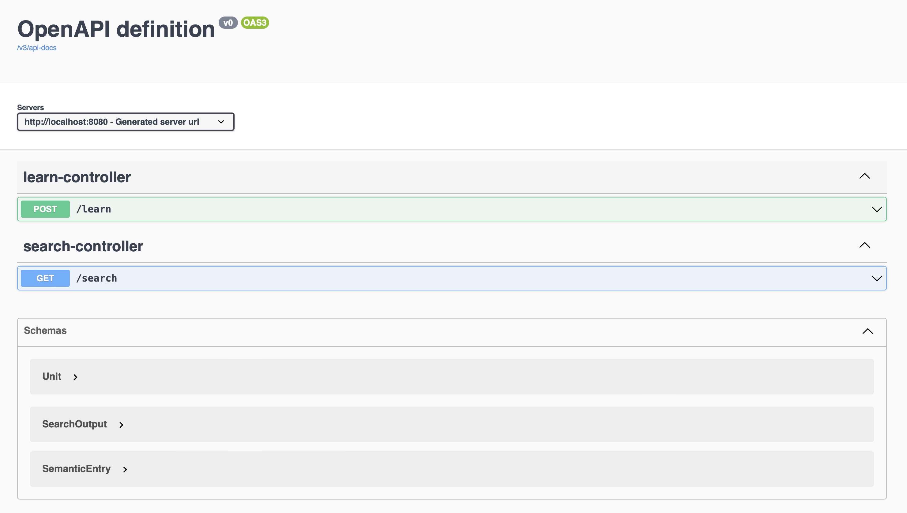
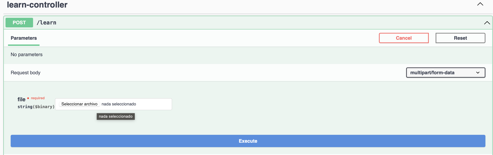

<!-- omit in toc -->
# eLLMental workshop

This workshop will teach you how to quickly create an basic semantic search application, using the using SpringBoot and eLLMental.

<!-- omit in toc -->
## Table of Contents

- [Prerequisites](#prerequisites)
- [Quick Start Guide](#quick-start-guide)
  - [Step 0: Clone the project](#step-0-clone-the-project)
  - [Step 1: Set up your development environment](#step-1-set-up-your-development-environment)
  - [Step 2: Understanding the structure of the project](#step-2-understanding-the-structure-of-the-project)
  - [Step 3: Setting up the development environment](#step-3-setting-up-the-development-environment)
  - [Step 4: Running the project](#step-4-running-the-project)
  - [Step 5: Complete the functionalities](#step-5-complete-the-functionalities)
  - [Step 6: Ingest the documentation](#step-6-ingest-the-documentation)
- [Testing the Application](#testing-the-application)

## Prerequisites

Before starting, make sure you have the following prerequisites:

1. Integrated Development Environment (IDE) - We recommend using IntelliJ IDEA as your IDE for this project. You can download the Community Edition from [IntelliJ IDEA](https://www.jetbrains.com/idea/download/?section=mac).

2. Java Development Kit (JDK) version 8 or above installed on your machine. If not, you can download it [using IntelliJ](https://www.jetbrains.com/help/idea/sdk.html#change-project-sdk), or from the official website [Oracle JDK](https://www.oracle.com/java/technologies/javase-jdk11-downloads.html).

3. Git - Make sure you have Git installed on your machine. You can download it from the official website: [Git](https://git-scm.com/downloads).

## Quick Start Guide

Follow the steps below to set up and build the Semantic Search service.

### Step 0: Clone the project

1. Clone the project repository from [GitHub](https://github.com/theam/workshop-eLLMental.git) using the command:

```shell
git clone https://github.com/theam/workshop-eLLMental.git
```

### Step 1: Set up your development environment

1. Open IntelliJ IDEA and click on `File -> Open`.
2. Navigate to the cloned project directory and select either `workshop-java` or `workshop-kotlin` project based on your preferred language.
3. Once the project is opened, switch to the `main` branch. You can use the terminal with the command `git checkout main` or find the button in the IDE's interface.

### Step 2: Understanding the structure of the project

The following example is the strcuture of the workshop-java project.

This project make use of the eLLMental library for making semantic search and use springboot for create services to consume this application. 

    .
    ├── resources               
    ├── workshop-java                                        # Project template for java workshop
    │   ├── src 
    |   |   ├── main 
    |   |   |    ├── java/com/theagilemonkeys/workshop
    |   |   |    |    ├── WorkshopApplication.java           # File used to execute the springboot application with IntelliJJ
    |   |   |    |    ├── config                             # Routine that gets the enviromental variables
    |   |   |    |    |    └── ....
    |   |   |    |    |── controllers                        # SpringBoot controllers
    |   |   |    |    |    └── ....
    |   |   |    |    |── services                           # Semantic search service and ingestion book
    |   |   |    |    |    └── ....
    |   |   |    └── resources
    |   |   |    |   |── application.yml                              # File to configure the enviromental variables
    |   |   |    |   └── The Pragmatic Programmer  - Dave Thomas, Andy Hunt.txt
    |   |   └──    test                                                          
    │   ├── grade                                                               
    │   ├── .gitignore                                                         
    │   ├── settings.gradle                                                      
    │   └── ...                                                                  
    └── workshop-kotlin
  
The project structure contains the following components:

- `src/main/java/com/theagilemonkeys/workshop`: This package contains the main application code.
  - `WorkshopApplication.java`: The entry point of the SpringBoot application.
  - `config`: This package contains the configuration for environmental variables.
  - `controllers`: Contains the SpringBoot controllers for handling HTTP requests.
  - `services`: Contains the Semantic Search service implementation.

- `src/main/resources`: This folder contains the application configuration files.
  - `application.yml`: A configuration file for setting up environmental variables.
  - `The Pragmatic Programmer - Dave Thomas, Andy Hunt.txt`: Sample documentation file.

### Step 3: Setting up the development environment

Before you start making changes to the code, you need to configure the application variables necessary for the Semantic Search service to work. Follow the steps below:

1. Open the `application.yml` file located in the `workshop-java/src/main/resources/` directory.

2. Modify the application variables with the values provided in our [1password](https://start.1password.com/open/i?a=Z7M3NNFDB5FWNDINTDJPDR6MI4&v=gohapx2edta6xazhcluyply6ku&i=xzh3u7o5zfgkvecmccd6dsuu2q&h=theagilemonkeys.1password.com).

3. **Make sure to use a unique value for `pineconeNamespace`.** For example, we suggest you use your first and last name, like `YOUR_FIRST_NAME_YOUR_LAST_NAME`. But you are more than welcome to be creative and have fun :stuck_out_tongue_closed_eyes:.

> [!WARNING]
> The unique value for `pineconeNamespace` is important to avoid conflicts with other developers in the workshop.

1. Save the changes to the `application.yml` file.

### Step 4: Running the project

To run the Semantic Search service, follow these steps:

1. Open IntelliJ IDEA.

2. Open the project by clicking on `File -> Open` and navigate to the cloned project directory.

3. In the project structure, go to `src/main/java/com/theagilemonkeys/workshop` and open the `WorkshopApplication.java` file.

4. Right-click on the `WorkshopApplication` class and select `Run 'WorkshopApplication'`.

   Alternatively, you can click on the green play button next to the `WorkshopApplication` class.

5. The application will start running locally on your machine.

Now you have set up your development environment and run the Semantic Search service.

### Step 5: Complete the functionalities

To use the eLLMental library for semantic search, you need to complete the following functionalities in the `SemanticSearchService`:

1. Get the application variables: Modify the `SemanticSearchService` to retrieve the application variables mentioned in the `application.yml` file.

2. Create necessary components: Initialize the OpenAI client, OpenAIEmbeddingsModel, and PineconeVectorStore to use the eLLMental library for semantic search. Refer to the [Getting Started](https://kotlin.ellmental.com/getting_started) documentation for more details.

3. Implement the `learn` function: This function processes and sends chunks of text to the vector database for learning purposes (creating embeddings). Before consuming this function, divide the text into smaller chunks using the appropriate function.

4. Implement the `search` function: This function performs embedding retrieval from the database based on user's input question.

Once the `SemanticSearchService` is fully implemented, you will also need to connect the code to the corresponding controllers. 

### Step 6: Ingest the documentation

Since vector stores only accept processed embeddings, you need to process the documentation before using the search service. In the example provided, the documentation is divided into smaller chunks of 1000 characters each. However, you can use more advanced methods for better performance.

1. Use the provided function in the kata to divide the documentation into smaller chunks.

2. Use the `learn` function in the `SemanticSearchService` to generate embeddings for each chunk.

3. Store the generated embeddings in a vector storage solution like Chroma.

> [!NOTE]
> In real-world scenarios, more advanced methods can be applied to process the documentation and achieve better results.

## Testing the Application

To test the Semantic Search service, we will use [Swagger](https://swagger.io/). It streamlines API documentation and testing by creating interactive and user-friendly documentation through API code annotations. Thus, developers and users can understand, explore, and interact with APIs more effectively.

1. Make sure the application is running locally on your machine on [http://localhost:8080](http://localhost:8080). You can verify this through the application logs. It should be there by default

2. Open a web browser and enter the following URL: [http://localhost:8080/docs](http://localhost:8080/docs).

3. Swagger will generate interactive and user-friendly documentation from the API code annotations, allowing you to explore and interact with the API endpoints effectively.The interface should look like this:



4. Use the Swagger UI to test various API endpoints and verify the functionality of the Semantic Search service. For instance, you can verify the functionality by clicking on the "Learn" service and selecting the `Try it out` button. This will allow you to upload a file and execute the learn routine.



Now you have successfully built and tested the Semantic Search service using SpringBoot. You can further enhance the functionality or integrate it into your own applications as needed.

Happy coding! :computer: :tada: