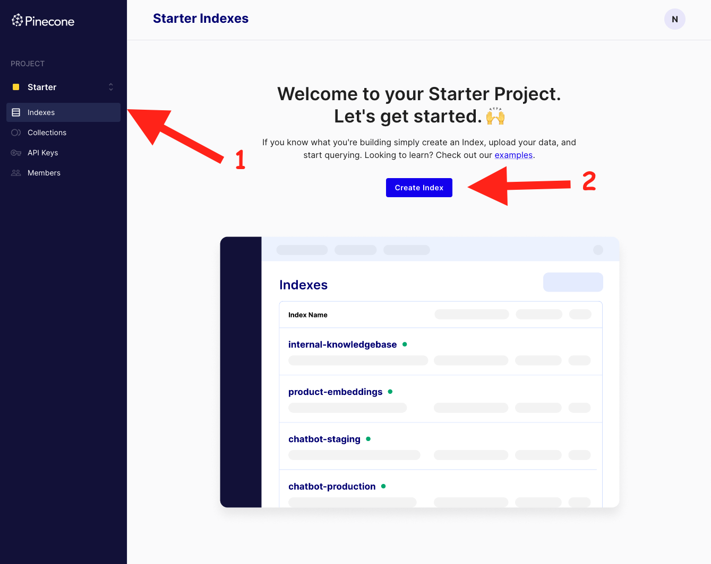
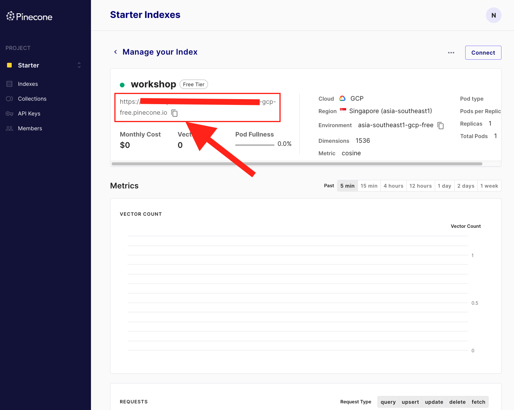
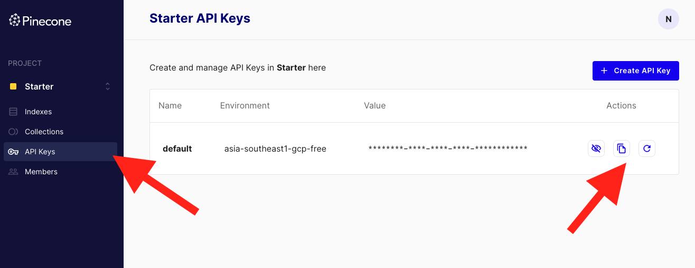
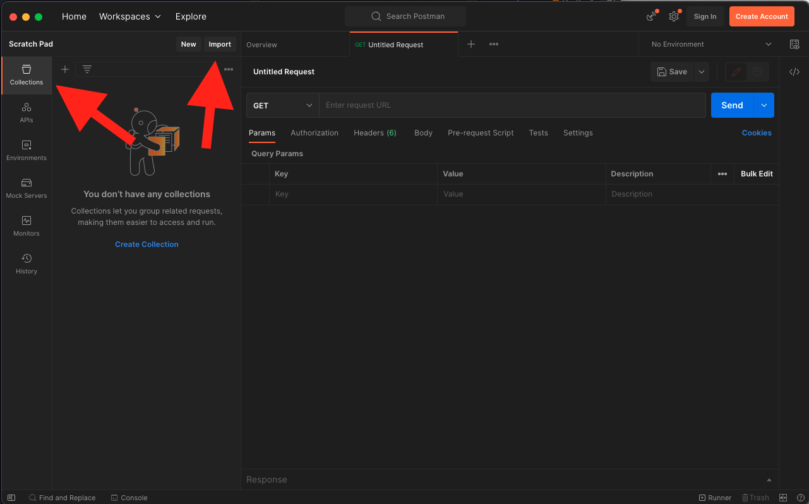
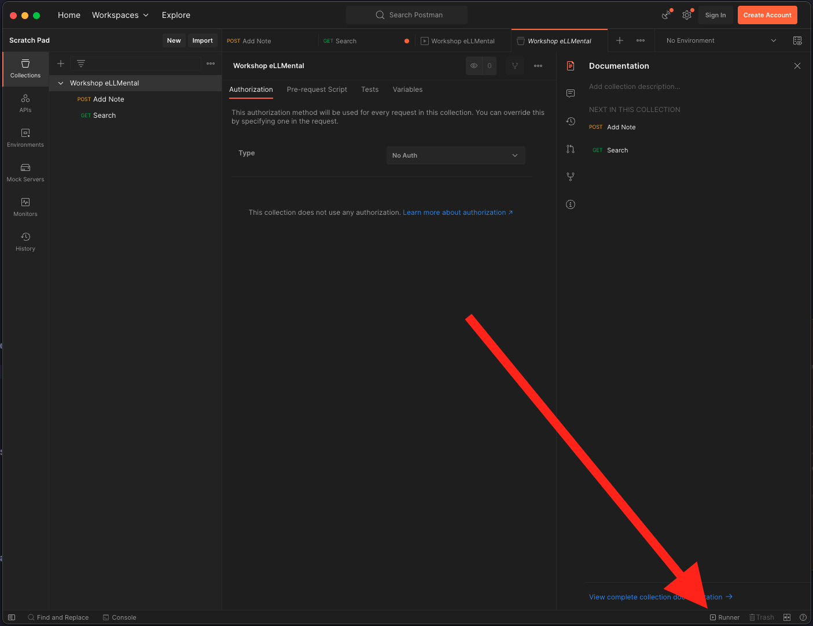
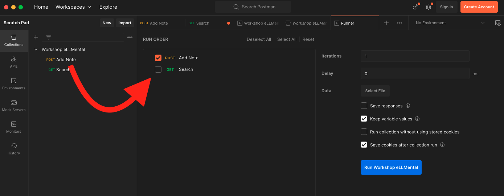
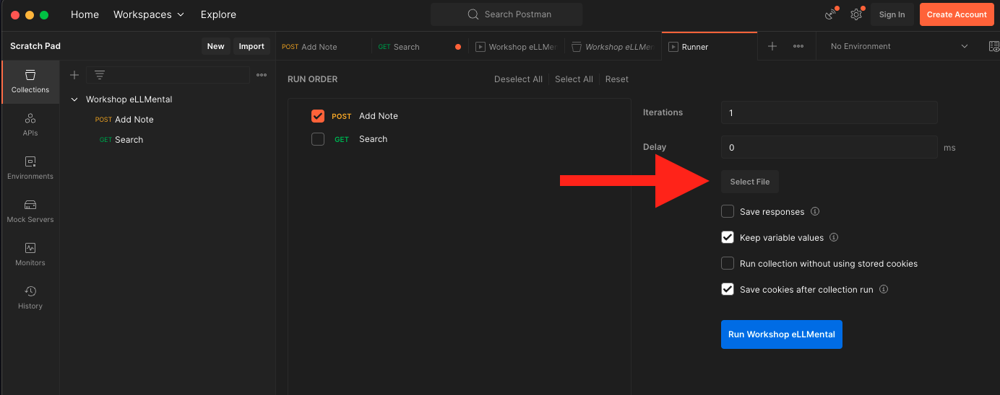
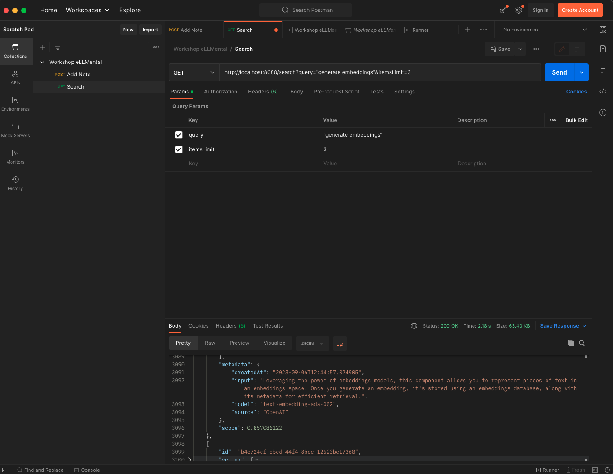

<div align="center">
    <h1>
        Building AI Java Applications
    </h1>
    <h2>
        Workshop on LLMs and Embeddings
    </h2>
    
</div>

# What I'm gonna do in this workshop?

You'll learn about Large Language Models (LLMs) and Embeddings, what's the hype about them and how to use pre-trained language models to supercharge your Java apps with AI capabilities. Then, we will build together a basic Java application that uses open source tools to leverage these concepts.

# Do I have to bring something prepared?

**Yes!** You will need to prepare the following things:


## 🧹 Dust off your Java skills

Although **we won't be doing anything advanced in terms of Java**, it is recommended that you have its syntax fresh. It is important that you are familiar with basic stuff like function calls, class definition, constructors, reading text from the console, as well as printing it.

If you are unsure what's the best way of refreshing this, we recommend you try the [**Exercism Java track**](https://exercism.org/tracks/java).


## 🐙 Have a GitHub account

The workshop template with starting material is going to be downloaded from GitHub. It is important that you have a [**GitHub**](http://www.github.com) account and know [**how to fork a repo](https://docs.github.com/en/get-started/quickstart/fork-a-repo).**


## 🌳 Ensure Git is installed and configured

To interact with GitHub, we will use Git. To install it:
- On Windows: `winget install --id Git.Git -e --source winget`
- On MacOS: `brew install git`
- On Ubuntu: `sudo apt install git`

Make sure that you're able to clone repos with git. Try running the following command: `git clone https://github.com/theam/eLLMental`.


## 💻  Get IntelliJ IDEA

Both community edition and ultimate work. Get the IntelliJ IDEA app from the official website.

If you're more comfortable with another IDE, do so at your own risk. We don't have much time so we won't be providing alternative support on this.

## ☕  Install Java JDK17

The IntelliJ IDEA app should help you download it. An alternative is to use SDKMAN. (After installing SDKMAN just run `sdk install java` and it should install JDK17 by default)

You can check which JDK version you have installed by running java -version (that's a single `-`)

## 🌲 Get a Pinecone account

We will be using Pinecone in the workshop. Don't worry, it is completely free to use.

Create a Pinecone account and save it for the workshop, we will be using it during the development process in the workshop.

|<h1>Getting our hands dirty!</h1>Begin by getting the code of this repo. You can either do it by cloning it or by downloading it as a [zip file](https://github.com/theam/workshop-eLLMental/archive/refs/heads/main.zip).||
|-----|----|


## Open the project with IntelliJ IDEA

Once you get the code, begin by opening the project using IntelliJ IDEA.

If all is correct, you should see the following file structure (only showing the relevant files):

```text
📁 workshop-eLLMental
├── 📁 src
│  ├── 📁 main
│  │  ├── 📁 java
│  │  │  └── 📁 com
│  │  │     └── 📁 theagilemonkeys
│  │  │        └── 📁 workshop
│  │  │           ├── 📁 config
│  │  │           │  └── ☕️ EmbeddingsSpaceConfiguration.java
│  │  │           ├── 📁 controllers
│  │  │           │  ├── ☕️ SaveController.java
│  │  │           │  └── ☕️ SearchController.java
│  │  │           ├── 📁 services
│  │  │           │  └── ☕️ EmbeddingsSpaceService.java
│  │  │           ├── 📁 utils
│  │  │           │  └── ☕️ StringSegmentationUtils.java
│  │  │           └── ☕️ WorkshopApplication.java
│  │  └── 📁 resources
│  │     └── 📄 application.yml
├── 📄 build.gradle
├── 📄 README.md
└── 📄 settings.gradle
```

## 📚 Creating a Pinecone Collection

For the app to work, we will need to set up a Pinecone Collection:

1. Begin by logging into your Pinecone account. 
   - Create a new project called "Workshop"
   - If not, follow the New Project wizard and name the new project "Workshop"
   - Use the **Las Vegas** - `us-west4-gcp-free` environment
2. Open the Indexes page and click on Create Index
   
3. Fill the form as follows:
   - **Name**: `workshop`
   - Configure your Index -> **Dimensions**: `1536`
   - **Metric**: `cosine`
   - Leave the rest as it is, click on **Create**.

Don't close the tab yet, you will need it for the next step.

## 🔧 Setting up the application configuration

In the IntelliJ window, open the `src/main/resources/application.yml` file.

We will begin replacing the `hello` values with actual values from the platforms.

### OpenAI API Key

For the OpenAI API key, use the one provided in the workshop chat. If you don't have the workshop's OpenAI API key, don't worry, you can use your own.

### Pinecone URL

In the Pinecone tab that you have open, copy the URL from the index information panel:



### Pinecone Namespace

This can be set to anything you want, it is a way of partitioning data under your index. We will use `workshop` as the namespace.

### Pinecone API Key

To get the API key, click on the **API Keys** tab in the Pinecone tab that you have open. Then click on **Create API Key**.

Copy the one you just created:



## 🤖 Initializing the EmbeddingsSpace service

If you take a look at the `src/main/java/com/theagilemonkeys/workshop/services/EmbeddingsService.java` file, you will see a fairly standard service class that wraps the
`EmbeddingsSpaceComponent` class from eLLMental:

```java
@Service
public class EmbeddingsSpaceService {
    private final EmbeddingsSpaceComponent embeddingsSpace;

    public EmbeddingsSpaceService(EmbeddingsSpaceConfiguration configuration) {
        // TODO: Add eLLMental SemanticSearch component
    }

    public Embedding save(String text) {
        // TODO: Implement method
        throw new UnsupportedOperationException("TODO");
    }

    public List<Embedding> search(String text, int itemsLimit) {
        // TODO: Implement method
        throw new UnsupportedOperationException("TODO");
    }
}
```

### Filling the constructor

We can go ahead and initialize the `embeddingsSpace` property by instantiating the `EmbeddingsSpaceComponent` class:

```java
this.embeddingsSpace = new EmbeddingsSpaceComponent();
```

You will notice that it requires two parameters: 

```java
EmbeddingsGenerationModel embeddingsGenerationModel
EmbeddingsStore embeddingsStore
```

This is because eLLMental is configurable to the core, allowing you to choose any implementation, including the possibility of creating your own!

Let's fix that by using the OpenAI embeddings generation model and the Pinecone embeddings store.

The constructor of the service class should look like this now:


```java
public EmbeddingsSpaceService(EmbeddingsSpaceConfiguration configuration) {
    var openAIModel = new OpenAIEmbeddingsModel(configuration.getOpenaiKey());
    var pineconeStore = new PineconeEmbeddingsStore(configuration.getPineconeKey(), configuration.getPineconeUrl(), configuration.getPineconeNamespace());
    this.embeddingsSpace = new EmbeddingsSpaceComponent(openAIModel, pineconeStore);
}
```

### Filling the `save` method

The `save` method from the `EmbeddingsSpaceComponent` class accepts the text that we want to save, which is a `String`, and returns an `Embedding`. We can go ahead and fill it like this:

```java
public Embedding save(String text) {
    return this.embeddingsSpace.save(text);
}
```

### Filling the `search` method

The `search` method from the `EmbeddingsSpaceComponent` can either accept an `Embedding` or a `String`. We will be searching by text, so we will pass the `String` to it, as well as the
`itemsLimit` value, to limit the results to the amount that we want to get from the store.

```java
public List<Embedding> search(String text, int itemsLimit) {
    return this.embeddingsSpace.mostSimilarEmbeddings(text, itemsLimit);
}
```

## 💾 Solving the `SaveController` class

Under the `controllers` folder, we can find the `SaveController` class, which looks like so:

```java
@RestController
public class SaveController {

    record SaveRequest(String text) {}

    private final EmbeddingsSpaceService embeddingsSpaceService;

    @Autowired
    public SaveController(EmbeddingsSpaceService embeddingsSpaceService) {
        this.embeddingsSpaceService = embeddingsSpaceService;
    }

    @PostMapping(value = "/save")
    @ResponseBody
    public void save(@RequestBody SaveRequest request) throws IOException {
        // TODO: implement the search functionality using the SemanticSearchService
        throw new UnsupportedOperationException("TODO");
    }
}
```

The `save` endpoint will use the `EmbeddingsSpaceService` class to save the text from the request:

```java
@PostMapping(value = "/save")
@ResponseBody
public void save(@RequestBody SaveRequest request) throws IOException {
    this.embeddingsSpaceService.save(request.text());
}
```

## 🔍 Solving the Search controller class

Under the same folder as before, you will find the `SearchController` class, which looks like so:

```java
@RestController
public class SearchController {
    private final EmbeddingsSpaceService embeddingsSpaceService;

    @Autowired
    public SearchController(EmbeddingsSpaceService embeddingsSpaceService) {
        this.embeddingsSpaceService = embeddingsSpaceService;
    }

    @GetMapping("/search")
    @ResponseBody
    public List<Embedding> search(@RequestParam String query, @RequestParam(defaultValue = "10") int itemsLimit) {
        // TODO: implement the search functionality using the SemanticSearchService
        throw new UnsupportedOperationException("TODO");
    }
}
```

The `search` endpoint will use the `EmbeddingsSpaceService` class to search the query from the request, limiting by the `itemsLimit` parameter:

```java
@GetMapping("/search")
@ResponseBody
public List<Embedding> search(@RequestParam String query, @RequestParam(defaultValue = "10") int itemsLimit) {
    return this.embeddingsSpaceService.search(query, itemsLimit);
}
```

## ✨ That's it! Time to try our app!

With this, we finished the coding part, we can now go ahead and try our backend!

In order to do this, run the project from the IntelliJ app menu: `Run > Run WorkshopApplication`

### Trying with Postman

We have provided a Postman collection that you can use to try the backend you just developed. You can import it in Postman in the collections section:



### Saving some notes

We can go ahead and save some notes, we have pre-created them for you so you don't have to think. But feel free to get inspired by the ones we provided
and add your own too!

For this, we will be using the Postman Runner feature, which allows you to run a collection of requests in a loop.

Click on the Runner button in the bottom right corner of Postman:



Once you opened this window, drag the `Add Note` request to the `Run Order` section. **Make sure that the `search` request is not checked**:



Now, in the right-most panel click on `Select File` and select the `notes.csv` file that you can find in the root of the project:



Now, go ahead and click on `Run Workshop eLLMental`, it will save 20 notes of different topics.


### Searching for similar notes

If you go ahead and use the `search` request, you can play with the `query` parameter to experiment with the results.

Note how the search results are related by their **meaning** rather than the text similarity.



Tip: You can collapse the fields of the response, like `vector` by clicking on the line number on the left of it.

### BONUS: Experimenting with the frontend

We've prepared a frontend for the application too, so you can not only try saving and searching for notes, but also seeing an approximate of how the
embeddings look like in the embeddings space.

Remember that the embeddings we're using have 1536 dimensions, so this is a reduction to 2 dimensions so we, as humans, can understand an approximate
of how it looks like.

`TODO: Add screenshot of the app`

# 🎁 It's a wrap!

Here ends the workshop, we hope that you learned your way through the usage of embeddings in Java and Spring Boot.

We invite you to join the [eLLMental Discord](https://discord.gg/34cBbvjjAx) and ask any questions that you have, we will be more than happy to
answer all of them!
