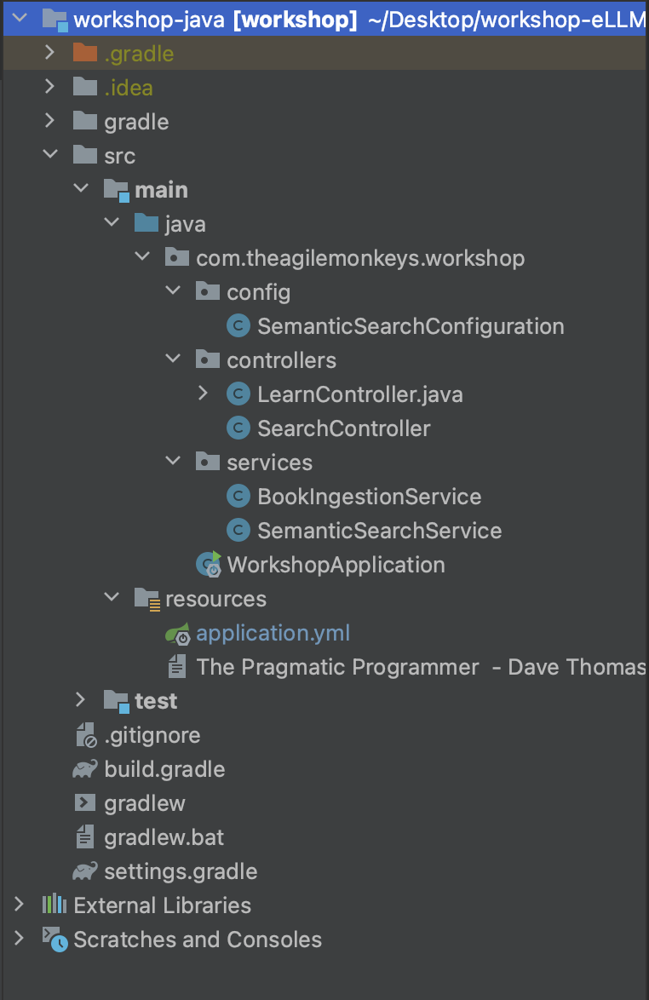

<!-- omit in toc -->
# eLLMental Kotlin - Java workshop - Kotlin workshop
<!-- omit in toc -->
## Description

This workshop will teach us how to quickly create an application, which is based on semantic search as the core, using 
the library of eLLMental kotlin.

<!-- omit in toc -->
## Table of Contents

- [Prerequisites](#prerequisites)
- [Quick Start Guide](#quick-start-guide)
  - [Step 0: Open the java application project.](#step-0-open-the-java-application-project)
  - [Step 1: Configure the enviromental variables.](#step-1-configure-the-enviromental-variables)
  - [Step 2: Understanding the structure of the project.](#step-2-understanding-the-structure-of-the-project)
  - [Step 3: Complete the functionalities](#step-3-complete-the-functionalities)
  - [Step 4: Ingest the documentation](#step-4-ingest-the-documentation)
- [How to test the application?](#how-to-test-the-application)

## Prerequisites

1. Please download the project [workshop-eLLMental](https://github.com/theam/workshop-eLLMental.git). If you find that you do not have access to this repository, please feel free to ask us to add you!

   In order to download the project execute the following command: 
   > git clone https://github.com/theam/workshop-eLLMental.git

2. To ensure a smooth and productive development experience, we highly recommend using IntelliJ IDEA as your primary 
Integrated Development Environment (IDE) for working with this project. You can download it from [IntelliJ IDEA](https://www.jetbrains.com/idea/download/?section=mac).
You can use the free trial version or introduce the key that it's in our 1password.

## Quick Start Guide

In this guide, you'll have your application based on a semantic search service up and running on your computer. 
To do this, we will need to have the eLLMental kotlin library and complete the template functions that we have provided to consume this library. 

### Step 0: Open the java application project.

If you're using IntelliJ IDEA, you can follow the steps below:

1. Open IntelliJ IDEA and click on File `Open`.
2. Select the workshop-java project inside workshop-eLLMental.
3. If everything is correct, you will see something like the following image. 

### Step 1: Configure the enviromental variables.

The environment variables, are dynamic values that can affect the behavior of software applications or the operating system. They provide a way to configure and control various aspects of an application's behavior without making direct changes to the code. Environmental variables are crucial for maintaining flexibility and security, enabling an application to adapt to different environments and scenarios.

We need to configure the enviromental variables before starting making changes to the code. You can modify the variables in the following file "workshop-java/src/main/resources/application.yml,". In addition, you can find the API keys in our [1password](https://start.1password.com/open/i?a=Z7M3NNFDB5FWNDINTDJPDR6MI4&v=gohapx2edta6xazhcluyply6ku&i=xzh3u7o5zfgkvecmccd6dsuu2q&h=theagilemonkeys.1password.com).

**IMPORTANT NOTE: The variable namespace should be unique for each individual. In this case, we suggest using your first name and your last name.**

### Step 2: Understanding the structure of the project.

This project is a webserver 

    .
    ├── resources               
    ├── workshop-java                                        # Project template for java workshop
    │   ├── src 
    |   |   ├── main 
    |   |   |    ├── java/com/theagilemonkeys/workshop
    |   |   |    |    ├── WorkshopApplication.java           # File used to execute the springboot application with IntelliJJ
    |   |   |    |    ├── config                             # Routine that gets the enviromental variables
    |   |   |    |    |    └── ....
    |   |   |    |    |── controllers                        # SpringBoot controllers
    |   |   |    |    |    └── ....
    |   |   |    |    |── services                           # Semantic search service and ingestion book
    |   |   |    |    |    └── ....
    |   |   |    └── resources
    |   |   |    |   |── application.yml                              # File to configure the enviromental variables
    |   |   |    |   └── The Pragmatic Programmer  - Dave Thomas, Andy Hunt.txt
    |   |   └──    test                                                          
    │   ├── grade                                                               
    │   ├── .gitignore                                                         
    │   ├── settings.gradle                                                      
    │   └── ...                                                                  
    └── workshop-kotlin

### Step 3: Complete the functionalities

In order to use the functionalities provided by eLLMental, we will need to use the SemanticSearch library. Below are the functionalities that we need to create:

The `learn` function is responsible for processing and sending chunks into the vector database for learning purposes (creating embeddings). Before consume this function  you need use the appropriate function to divides the book into smaller chunks for processing it.

On the other hand, the `search` function allows you to perform embedding retrieval from the database. This function expects to recieve the user's question.

Furthermore, we will develop HTTP services with SpringBoot to interact with the backend. This allows you to seamlessly integrate eLLMental's robust semantic search and learning capabilities into your applications and leverage its advanced natural language processing functionalities.

### Step 4: Ingest the documentation

Since eLLMental currently only receives processed embeddings, we need to process the documentation first. In this kata, we have provided a basic function that divides the book into smaller chunks to fit the context window of the embedding model. For simplicity, we adopt a straightforward 
approach in this example, dividing the text into chunks of 1000 characters each. However, it's important to note that **more sophisticated methods are available**, and **utilizing them can significantly enhance the performance of semantic search**.

Once the documentation is divided into chunks, we can employ the "learn" function of SemanticSearch to generate embeddings for each chunk. These embeddings represent the semantic meaning of the text and serve as the foundation for efficient searching and matching of queries.

After generating the embeddings, we store them locally in Chroma (or another solution like pinecone), a vector storage solution. This ensures that the processed documentation is readily accessible for future searches and analysis, eliminating the need to repeatedly process the original text.

Remember, while we used a simple approach to process the documentation in this example, more advanced methods can be applied to achieve even better results in real-world scenarios.

## How to test the application?

